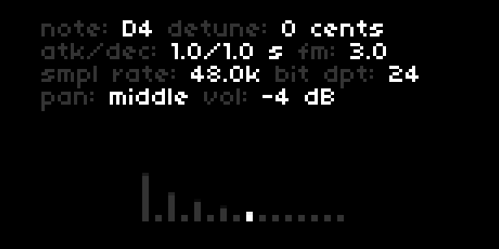

# BP Noise

A white noise synth with 16 independant band pass filters tuned per voice. Filter Q can be adjusted per filter

## Installation

Ensure you are up to date with the latest norns OS. Visit http://norns.local/ in a browser, and install bp_noise by entering the following in the maiden REPL: 

`;install https://github.com/aidanreilly/bp_noise`

Then, `SYSTEM => RESET` on norns to pick up the new SuperCollider engine. Reboot for good measure.

## Play

Select a root note and scale from the norns parameters menu. 16 frequencies based on the selected scale are applied to the band pass filters. You can also tune the filter center frequencies by hand on norns. 

Controls:

* [E1] master volume
* [E2] select bp filter 1-16
* [E3] set amplitude
* [K1] exit to norns main menu
* [K2] + [E2] change note
* [K2] + [E3] detune center frequency
* [K3] + [E2] change envelope
* [K3] + [E3] change filter Q
* [K1] + [E2] - change sample rate
* [K1] + [E3] - change bit depth
* [K2] + [K3] toggle voice pannning between 'middle' and odd numbered voices hard left, even numbered voices hard right. 

Saving a pset saves the note selection and midi mapping. The last saved pset is loaded when the app launches.

### Optional

Control individual amplitudes, envelopes, bit depth, sample rate, and filter Q with a midi controller. Controls are mapped from the norns parameters page.

